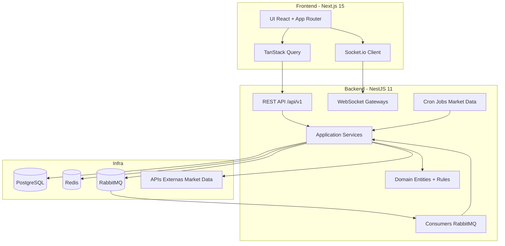
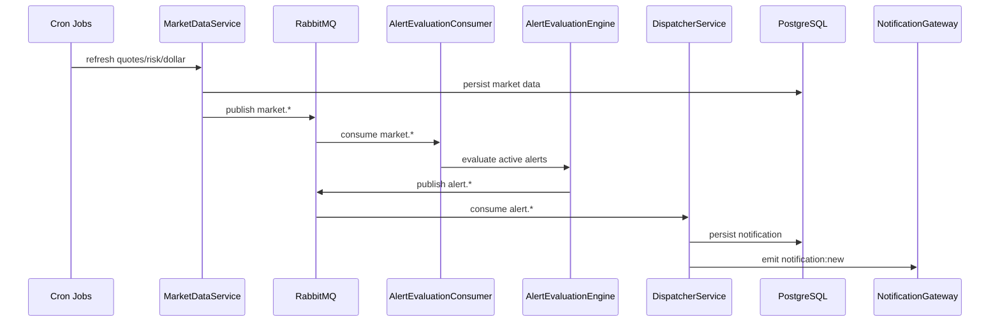

# NotiFinance — Arquitectura Técnica

## 1. Propósito del documento

Este documento describe en detalle la arquitectura de NotiFinance desde una perspectiva técnica: estructura por capas, módulos, contratos, decisiones de tecnología, trade-offs, riesgos y extensibilidad.

Su objetivo es permitir que cualquier perfil técnico (backend, frontend, arquitectura, QA, DevOps) entienda rápidamente:

- qué se construyó,
- por qué se eligieron estas tecnologías,
- cómo se comunican los componentes,
- qué compromisos de diseño se asumieron.

---

## 2. Vista de alto nivel

NotiFinance es una plataforma de seguimiento financiero con backend event-driven y frontend web.

---

## 3. Principios arquitectónicos

### 3.1 Arquitectura Hexagonal / Clean Architecture

El backend aplica separación estricta de capas:

1. **Domain**: reglas de negocio puras, sin NestJS/TypeORM.
2. **Application**: casos de uso y contratos (ports/interfaces).
3. **Infrastructure**: adapters HTTP/DB/broker/cache/external APIs.

Regla clave de dependencias:

- `infrastructure -> application -> domain`
- `domain` no depende de ninguna capa externa.

### 3.2 Event-driven como eje transversal

- Ingesta de mercado y eventos asíncronos sobre RabbitMQ.
- Evaluación de alertas desacoplada de API HTTP.
- Notificaciones persistidas y distribuidas por canales.

### 3.3 Type Safety y contratos explícitos

- TypeScript estricto.
- DTOs de request/response para fronteras HTTP.
- Validación de entrada con `class-validator`.

---

## 4. Backend en detalle

## 4.1 Módulos funcionales

| Módulo | Responsabilidad principal | Entradas | Salidas |
|---|---|---|---|
| `auth` | Registro/login/refresh/demo | REST | JWT + usuario |
| `market-data` | Activos, cotizaciones, riesgo, resumen | REST + Cron + APIs externas | Datos de mercado + eventos |
| `alert` | CRUD de alertas + motor de evaluación | REST + eventos de mercado | eventos `alert.*` |
| `notification` | Persistencia + entrega de notificaciones | eventos `alert.*` + REST | inbox + WS + canal email/in-app |
| `portfolio` | Portfolios, trades, holdings, distribución/performance | REST | métricas de portfolio |
| `watchlist` | favoritos por usuario | REST | lista de activos monitoreados |
| `preferences` | preferencias de notificación | REST | configuración de canales/frecuencia |
| `template` | templates de notificación | REST + app services | render de mensajes |
| `ingestion` | publicación/recepción de eventos | REST + broker | eventos en exchange topic |

## 4.2 Flujo de mercado a notificación

## 4.3 API y versionado

- Prefijo global: `/api/v1`.
- Excepción explícita: endpoint de salud (`/health`).
- Documentación OpenAPI en Swagger.

## 4.4 Persistencia

### Motor principal: PostgreSQL

Se usa para estado transaccional y trazabilidad histórica:

- usuarios,
- preferencias,
- activos,
- quotes,
- alertas,
- notificaciones,
- portfolios/trades/watchlist.

### Cache y coordinación: Redis

- cache de datos de mercado,
- soporte de lockout/controles de auth,
- elementos efímeros de performance.

### Mensajería: RabbitMQ

- exchange tipo topic para enrutamiento por dominio (`market.*`, `alert.*`),
- colas específicas de evaluación y despacho,
- patrón asíncrono para desacoplar latencia de APIs externas y procesamiento.

---

## 5. Frontend en detalle

## 5.1 Stack y responsabilidades

- **Next.js 15 + React 19**: app web con App Router.
- **TanStack Query**: sincronización y cache de datos remotos.
- **Zustand**: estado de sesión/tema y estado global liviano.
- **Socket.io client**: actualizaciones en tiempo real (market y notifications).
- **shadcn/ui + Tailwind**: sistema visual consistente.

## 5.2 Estructura funcional

Rutas principales:

- Públicas: dashboard, assets, detail, login/register.
- Protegidas: watchlist, portfolio, alerts, notifications, settings.

Capas internas del frontend:

1. **UI components** (`src/components`)
2. **Hooks de datos** (`src/hooks`)
3. **Capa de acceso HTTP/WS** (`src/lib/api`, providers de socket)
4. **Stores** (`src/stores`)

---

## 6. Decisiones tecnológicas y justificación

## 6.1 NestJS (backend)

**Por qué:** modularidad, DI nativo, ecosistema robusto para REST/WS/schedule.

**Trade-off:** mayor complejidad inicial vs Express plano.

## 6.2 TypeORM + PostgreSQL

**Por qué:** equilibrio entre productividad y control relacional.

**Trade-off:** overhead de mapeo ORM y tuning para queries complejas.

## 6.3 Redis

**Por qué:** latencia baja para cache y controles temporales.

**Trade-off:** invalidez de cache y coherencia eventual a gestionar.

## 6.4 RabbitMQ

**Por qué:** routing flexible por tópicos, desacople entre productores/consumidores.

**Trade-off:** operación más compleja que colas administradas simples.

## 6.5 Next.js + React Query

**Por qué:** buen DX para producto fullstack, fetch/cache declarativo y revalidación.

**Trade-off:** más abstracción; requiere disciplina para evitar duplicación estado-servidor/cliente.

---

## 7. Seguridad, robustez y observabilidad

### 7.1 Seguridad

- validación global estricta de input,
- JWT para rutas protegidas,
- guardas y límites de acceso por endpoint,
- secretos por variables de entorno.

### 7.2 Robustez

- fallback a persistencia/caches cuando proveedores externos fallan,
- jobs por lotes con retry/backoff configurable,
- manejo explícito de errores de dominio.

### 7.3 Observabilidad

- logging estructurado,
- endpoint de health,
- trazabilidad por eventos y timestamps de actualización.

---

## 8. Trade-offs globales del sistema

1. **Consistencia vs disponibilidad**
     - Se privilegia disponibilidad ante fallas de proveedores externos usando fallbacks.
     - Costo: posibles ventanas de datos stale.

2. **Desacople vs simplicidad operativa**
     - Event-driven reduce acoplamiento y mejora escalabilidad.
     - Costo: más piezas de infraestructura y mayor complejidad diagnóstica.

3. **Velocidad de entrega vs cobertura funcional total**
     - Se priorizó cerrar el plan técnico y hardening incremental.
     - Costo: ciertas funcionalidades de SRS quedan como backlog (ver sección de cobertura).

---

## 9. Estado de implementación y cobertura

### 9.1 Estado técnico actual

- Backend: build/lint/test/e2e en verde.
- Frontend: lint/test/build/e2e en verde.
- Integración principal de dominios implementada y auditada.

### 9.2 Cobertura funcional frente al SRS

El proyecto está **funcionalmente sólido y consistente con el plan ejecutado**, pero no debe declararse como 100% del SRS original sin reservas:

- El SRS incluye alcance más amplio y variantes de producto que en el plan técnico fueron simplificadas o diferidas.
- Existen puntos con fallback/mock controlado en frontend para resiliencia y continuidad de UX.
- El criterio correcto de cierre actual es: **plan técnico implementado y validado; cobertura SRS alta pero no absoluta**.

Para auditoría de trazabilidad detallada requisito-a-requisito, usar:

- [docs/01-requirements-specification.md](docs/01-requirements-specification.md)
- [docs/03-implementation-plan.md](docs/03-implementation-plan.md)
- [docs/implementation-progress.md](docs/implementation-progress.md)

---

## 10. Roadmap técnico recomendado

1. Completar backlog de requisitos diferidos del SRS con matriz formal RF -> endpoint/UI/test.
2. Reducir dependencias de fallback mock en frontend hacia integración 100% live-data.
3. Reforzar monitoreo operativo (dashboards de cola, latencia por módulo, errores por dominio).
4. Consolidar estrategia de despliegue productivo con servicios gestionados y runbooks.

---

## 11. Referencias

- Contexto del proyecto: [.github/project-context.md](.github/project-context.md)
- Reglas de desarrollo: [.github/development_rules.md](.github/development_rules.md)
- Especificación técnica: [docs/02-technical-specification.md](docs/02-technical-specification.md)
- Progreso de implementación: [docs/implementation-progress.md](docs/implementation-progress.md)
